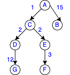

# Input & Output
- Input files are present at path
> data/input{number}.json
- For ease of visualization, the trees representing the json files are present in
> data/input{number}.png

For example, for the JSON:
```
{
  "A": {
    "start": "True",
    "edges": {
      "B": 15,
      "C": 1
    }
  },
  "B": {
    "edges": {}
  },
  "C": {
    "edges": {
      "D": 2,
      "E": 2
    }
  },
  "D": {
    "edges": {
      "G": 12
    }
  },
  "E": {
    "edges": {
      "F": 3
    }
  },
  "F": {
    "edges": {}
  },
  "G": {
    "edges": {}
  }
}
```
The tree looks like:


# Run

``` workflow_run.py``` contains the code to print the DAG nodes after wait time specified on the edges.
> python workflow_run.py data/input1.json

Sample output:
```
Nodes in order of printing and 'T' seconds after which they should be printed:
[(0, 'A'), (5, 'B'), (7, 'C')]
A
Printing B after 5 seconds
Printing C after 2 seconds

```

